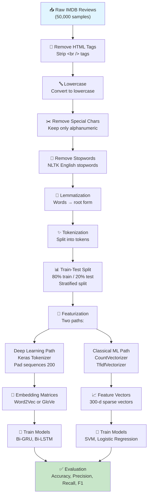
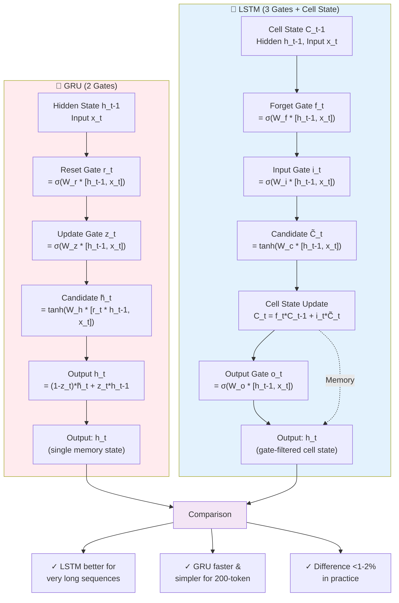
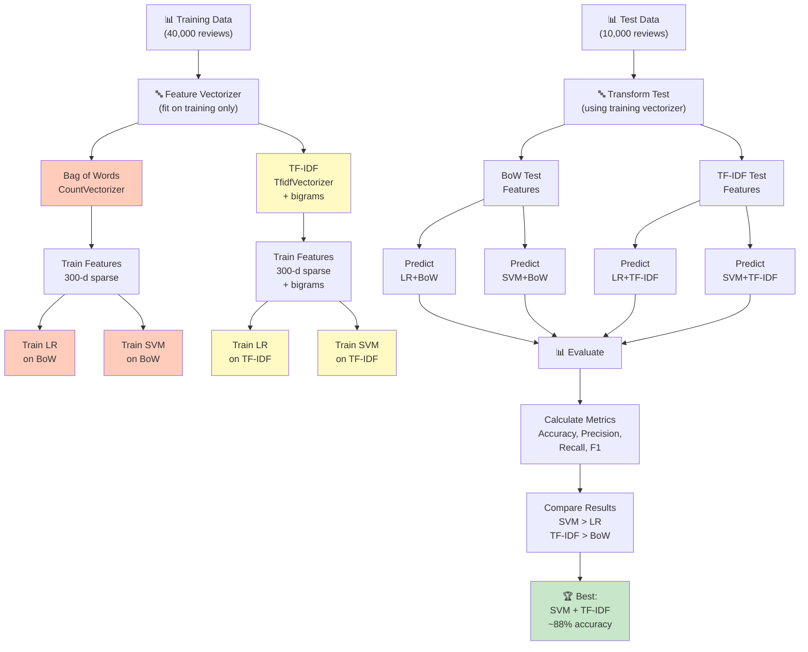
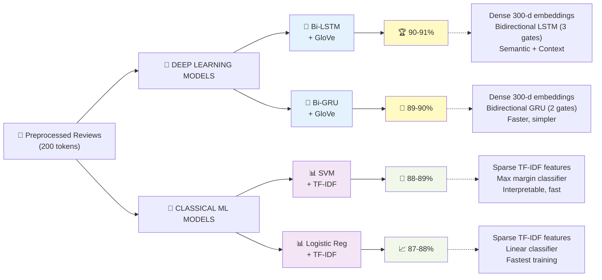
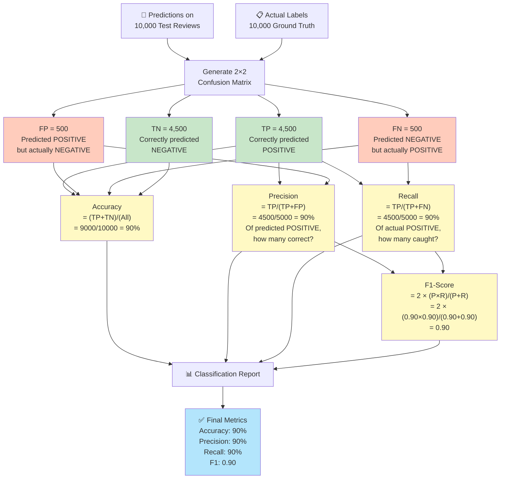
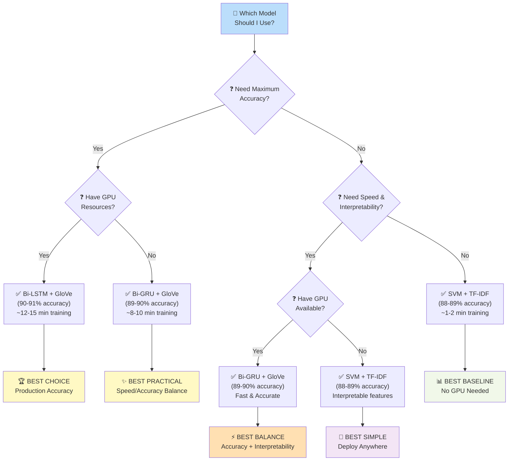
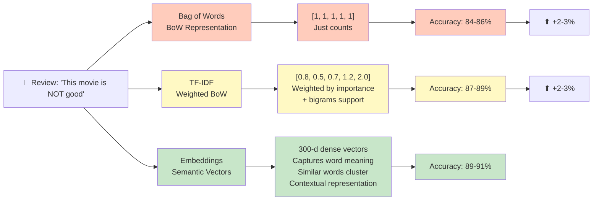
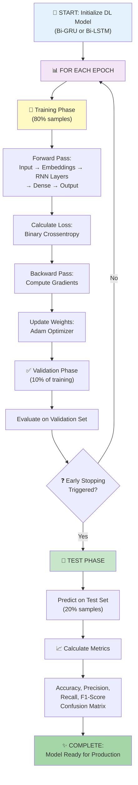
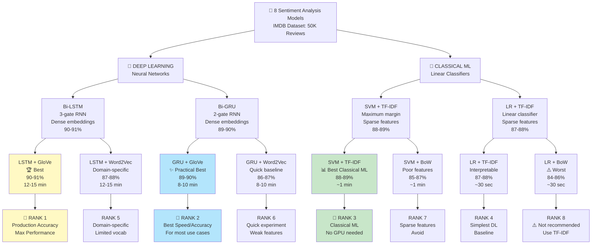

# CSE 4221: Multi-Model Sentiment Analysis Comparison

## 📋 Assignment Overview

**Objective:** Implement and compare 4 distinct NLP architectures (2 deep learning models, 2 classical machine learning models) for binary sentiment classification on the IMDB Movie Review Dataset.

**Course:** CSE 4221 — Natural Language Processing  
**Dataset:** IMDB-Dataset.csv (50,000 reviews with balanced sentiment labels)

---

## 📊 Dataset Information

### Dataset Characteristics

- **Total Samples:** 50,000 movie reviews
- **Classes:** Binary classification (Positive = 1, Negative = 0)
- **Class Distribution:** Perfectly balanced (25,000 positive, 25,000 negative)
- **Example Review:** Unstructured movie reviews ranging from 1-1000+ characters
- **Train/Test Split:** 80% training (40,000 samples) / 20% testing (10,000 samples)
- **Split Strategy:** Stratified split to maintain class balance

### Data Preprocessing Pipeline

All models use identical preprocessing:

1. **HTML Tag Removal:** Strip `<br />` and other HTML tags
2. **Lowercasing:** Convert all text to lowercase
3. **Special Character Removal:** Keep only alphanumeric characters and spaces
4. **Stopword Removal:** Remove common English words (NLTK stopword list)
5. **Lemmatization:** Reduce words to root form (e.g., "running" → "run")
6. **Tokenization:** Split text into individual word tokens
7. **Padding/Truncation:** Standardize to 200 tokens per review

### Feature Vector Specifications

- **Vocabulary Size:** 20,000 unique tokens
- **Sequence Length:** 200 tokens (padded with zeros or truncated)
- **For Embedding Models:** 300-dimensional word embeddings
- **For Classical ML:** 300-dimensional feature vectors (TF-IDF or BoW)

### Data Processing Pipeline Flowchart



---

## 🤖 Model 1: Bidirectional GRU + Word2Vec/GloVe

### 1.1 Model Architecture

```
Input (Sequence of 200 tokens)
         ↓
Embedding Layer (300-dimensional word vectors)
         ↓
SpatialDropout1D (0.3) — prevents co-adaptation of embeddings
         ↓
Bidirectional GRU (128 units, return_sequences=True)
         ↓
SpatialDropout1D (0.3)
         ↓
Bidirectional GRU (64 units, return_sequences=False)
         ↓
Dropout (0.3)
         ↓
Dense Layer (64 units, ReLU activation)
         ↓
Dropout (0.3)
         ↓
Output Dense Layer (1 unit, Sigmoid activation) → Probability [0, 1]
```

### 1.2 Architecture Explanation

**GRU (Gated Recurrent Unit):**

- **Purpose:** Processes sequential text while capturing long-range dependencies
- **Gates:** 2 gates (Reset gate + Update gate)
- **Bidirectional:** Processes text both forward and backward, capturing context from both directions
- **Layer 1 (128 units):** Captures high-level sentiment patterns
- **Layer 2 (64 units):** Refines predictions with deeper abstraction
- **SpatialDropout:** Randomly drops entire feature maps to prevent overfitting in sequences

### 1.3 Embedding Methods

#### **Method A: Word2Vec (Corpus-Trained)**

- **Training Approach:** Train on the 50,000 IMDB reviews using Gensim
- **Embedding Dimension:** 300-dimensional vectors
- **Parameters:** Window size = 5, epochs = 10
- **Advantage:** Domain-specific to movie reviews
- **Limitation:** Limited vocabulary (only words from IMDB reviews)

#### **Method B: GloVe (Pre-trained from Stanford)**

- **Training Source:** Pre-trained on 6 billion English tokens
- **Embedding Dimension:** 300-dimensional vectors
- **Coverage:** Broader vocabulary, includes common English words
- **Advantage:** Better generalization to unseen/rare words
- **Why Better than Word2Vec:** GloVe uses co-occurrence statistics that capture both global and local context

### 1.4 Training Configuration

| Parameter        | Value                                                         |
| ---------------- | ------------------------------------------------------------- |
| Optimizer        | Adam (learning rate: default)                                 |
| Loss Function    | Binary Crossentropy                                           |
| Metrics          | Accuracy                                                      |
| Batch Size       | 64                                                            |
| Max Epochs       | 10                                                            |
| Validation Split | 10% (from training data)                                      |
| Early Stopping   | Patience = 3 (stops if val_loss doesn't improve for 3 epochs) |
| Regularization   | Dropout (0.3) + SpatialDropout (0.3)                          |

### 1.5 Step-by-Step Workflow

1. **GPU Setup & Verification**
   - Check CUDA availability
   - Enable memory growth to prevent OOM

2. **Load Dataset**
   - Download IMDB-Dataset.csv
   - Verify shape: (50000, 2) — reviews and sentiments

3. **Text Preprocessing**
   - Apply all preprocessing steps (HTML removal, lowercasing, lemmatization, etc.)
   - Result: Clean tokenized reviews

4. **Train-Test Split**
   - Stratified split: 40,000 train / 10,000 test
   - Maintain 50-50 class distribution in both sets

5. **Tokenization & Padding**
   - Use Keras Tokenizer on training data only
   - Convert text to sequences of integers
   - Pad sequences to 200 tokens

6. **Word2Vec Embedding Matrix**
   - Train Word2Vec model on training reviews
   - Create embedding matrix (vocab_size × 300)
   - Initialize Embedding layer with this matrix

7. **Model Building (Word2Vec Variant)**
   - Stack GRU layers with dropout
   - Compile with Adam optimizer
   - Print model summary

8. **Training**
   - Fit model on training data
   - 10% validation split for early stopping
   - Monitor training/validation curves

9. **Evaluation on Test Set**
   - Predict sentiment probabilities
   - Convert to binary predictions (threshold=0.5)
   - Calculate: Accuracy, Precision, Recall, F1-Score
   - Generate confusion matrix

10. **GloVe Variant**
    - Repeat steps 6-9, but use pre-trained GloVe embeddings

11. **Comparison**
    - Compare Word2Vec vs GloVe performance
    - Document findings

### 1.6 Key Hyperparameters Explained

- **Batch Size (64):** Balance between computation and generalization
- **Dropout (0.3):** 30% neurons deactivated randomly to prevent overfitting
- **GRU Units (128→64):** Progressive compression of information
- **Bidirectional:** Each layer has forward RNN + backward RNN = 2× parameters but much better context

---

## 🤖 Model 2: Bidirectional LSTM + Word2Vec/GloVe

### 2.1 Model Architecture

```
Input (Sequence of 200 tokens)
         ↓
Embedding Layer (300-dimensional word vectors)
         ↓
SpatialDropout1D (0.3)
         ↓
Bidirectional LSTM (128 units, return_sequences=True)
         ↓
SpatialDropout1D (0.3)
         ↓
Bidirectional LSTM (64 units, return_sequences=False)
         ↓
Dropout (0.3)
         ↓
Dense Layer (64 units, ReLU activation)
         ↓
Dropout (0.3)
         ↓
Output Dense Layer (1 unit, Sigmoid activation)
```

### 2.2 GRU vs LSTM Comparison

| Aspect                      | GRU               | LSTM                               |
| --------------------------- | ----------------- | ---------------------------------- |
| **Gates**                   | 2 (Reset, Update) | 3 (Input, Forget, Output)          |
| **Parameters**              | Fewer             | More (1.5x GRU)                    |
| **Training Speed**          | Faster            | Slower                             |
| **Memory**                  | Lower             | Higher                             |
| **Expressivity**            | Good              | Slightly Better                    |
| **Cell State**              | Hidden state only | Separate cell state + hidden state |
| **Long-Range Dependencies** | Good              | Excellent                          |

### GRU vs LSTM Architecture Flowchart



**Key Difference:**

- **GRU:** Single hidden state, 2 gates, faster
- **LSTM:** Separate cell state + hidden state, 3 gates, slightly better for very long sequences

### 2.3 LSTM Technical Details

**LSTM Structure:**

- **Input Gate:** Determines what new information enters the cell state
- **Forget Gate:** Decides what information to discard from previous cell state
- **Cell State (Memory):** Maintains long-term context across sequences
- **Output Gate:** Filters cell state to produce hidden state output

**Why Separate Cell State?**

- Allows LSTM to maintain gradients over very long sequences (100+ timesteps)
- Cell state acts as "memory" unchanged except for controlled additions/deletions
- Better for capturing subtle sentiment shifts in long reviews

### 2.4 Embeddings & Training

- **Same Embeddings:** Word2Vec (corpus-trained) and GloVe (pre-trained)
- **Identical Configuration:** Same optimizer, loss, batch size, epochs, dropout
- **Same Preprocessing:** Identical to Bi-GRU notebook

### 2.5 Expected Performance

- **Slightly Better Accuracy than Bi-GRU:** Due to extra gate (more expressive)
- **Slower Training:** ~1.5x slower than Bi-GRU (same epochs, more parameters)
- **Reduced Overfitting Risk:** Extra parameters can model complex patterns better
- **For This Dataset:** Difference may be marginal (<1% accuracy difference)

### 2.6 Step-by-Step Workflow

Same as Bi-GRU (steps 1-11), with only the RNN layer type changed from GRU to LSTM.

---

## 📈 Model 3: Logistic Regression + BoW/TF-IDF

### 3.1 Model Overview

Logistic Regression is a linear classifier that learns a decision boundary for binary classification.

```
Input Text Reviews
         ↓
Feature Vectorization (BoW or TF-IDF)
         ↓
Logistic Regression Classifier
         ↓
Binary Prediction (0 or 1)
```

### 3.2 Bag of Words (BoW) Features

**How BoW Works:**

1. Create vocabulary of top 300 most frequent words
2. For each review, count occurrences of each word
3. Result: 300-dimensional vector with word counts

**Example:**

```
Vocabulary: ["good", "bad", "movie", "great", ...(297 more words)]

Review: "This movie is good and great"
BoW Vector: [1, 0, 1, 1, 0, 0, ..., 0]
            ↑ good, ↑ movie, ↑ great
```

**Characteristics:**

- **Pros:** Simple, interpretable, captures word frequency importance
- **Cons:** Ignores word order, treats all words equally, no semantic understanding

### 3.3 TF-IDF Features (Better Alternative)

**How TF-IDF Works:**

- **TF (Term Frequency):** How often a word appears in a document (normalized)
- **IDF (Inverse Document Frequency):** How unique the word is across all documents
- **TF-IDF Score:** TF × IDF (common words get lower scores, unique words get higher scores)

**Formula:**
$$\text{TF-IDF}(t, d) = \text{TF}(t, d) \times \log\left(\frac{N}{\text{df}(t)}\right)$$

Where:

- $t$ = term (word)
- $d$ = document (review)
- $N$ = total documents
- $\text{df}(t)$ = documents containing $t$

**Example Impact:**

- "the" appears in 90% of reviews → Low IDF → Low TF-IDF
- "compelling" appears in 5% of reviews → High IDF → High TF-IDF
- Result: Discriminative words (like "compelling") get higher weights

**Bigram Support (n-gram_range=(1,2)):**

- **Unigrams:** Single words ("good", "movie")
- **Bigrams:** Two-word phrases ("very good", "action-packed")
- **Why Bigrams Help:** Captures sentiment-bearing phrases ("not good" is negative, unlike separate words)

**Sublinear TF Scaling:**

- Reduces impact of extremely frequent words (scaling: $\log(1 + \text{tf})$)
- Prevents high-frequency words from dominating the feature space

### 3.4 Logistic Regression Classifier

**Model Configuration:**

- **Solver:** lbfgs (L-BFGS-B optimization algorithm)
- **Max Iterations:** 1000
- **Random State:** 42 (reproducibility)
- **Regularization:** L2 (default, prevents overfitting)

**How It Works:**

1. Learn linear weights for each of the 300 features
2. Compute: $z = w_1x_1 + w_2x_2 + ... + w_{300}x_{300} + b$
3. Apply sigmoid: $\hat{y} = \frac{1}{1 + e^{-z}}$ (converts to probability)
4. Predict: class = 1 if $\hat{y} > 0.5$, else 0

**Why Good for Text:**

- Linear classifier works surprisingly well for high-dimensional sparse text
- Easy to interpret: positive weights → sentiment positive features

### 3.5 Step-by-Step Workflow

1. **Load & Preprocess Data**
   - Load IMDB-Dataset.csv
   - Apply preprocessing (HTML removal, lowercasing, lemmatization, etc.)

2. **Train-Test Split**
   - Stratified split: 40,000 train / 10,000 test

3. **Create BoW Vectorizer**
   - CountVectorizer with max_features=300
   - Fit on training data only (prevent data leakage)
   - Transform: text → numerical counts

4. **Train Logistic Regression on BoW**
   - Fit LR classifier on training features
   - Predict on test set
   - Calculate: Accuracy, Precision, Recall, F1

5. **Create TF-IDF Vectorizer**
   - TfidfVectorizer with max_features=300
   - ngram_range=(1,2) to include bigrams
   - Sublinear_tf=True for scaling
   - Fit on training data only

6. **Train Logistic Regression on TF-IDF**
   - Fit LR classifier on training features
   - Predict on test set
   - Calculate metrics

7. **Compare BoW vs TF-IDF**
   - Create comparison table
   - Analyze which features are most important

### 3.6 Feature Importance Analysis

Logistic Regression learns weights $w$ for each feature.

- **Positive weights** → associated with positive sentiment
- **Negative weights** → associated with negative sentiment
- **Magnitude** → strength of association

Example top features:

```
Positive sentiment: "excellent" (+2.5), "loved" (+2.3), "masterpiece" (+2.1)
Negative sentiment: "terrible" (-2.6), "waste" (-2.4), "awful" (-2.3)
```

### 3.7 Why TF-IDF Typically Outperforms BoW

| Aspect                | BoW                              | TF-IDF                          |
| --------------------- | -------------------------------- | ------------------------------- |
| **Word Weighting**    | Equal for all words              | Higher for discriminative words |
| **Handles Stopwords** | Treats "the" same as "excellent" | Down-weights common words       |
| **Semantic Context**  | None                             | Implicit via term relevance     |
| **Typical Accuracy**  | ~85-87%                          | ~87-89%                         |

---

## 📈 Model 4: Support Vector Machine (SVM) + BoW/TF-IDF

### 4.1 Model Overview

SVM finds the optimal hyperplane that maximally separates positive and negative reviews.

```
Input Text Reviews
         ↓
Feature Vectorization (BoW or TF-IDF)
         ↓
Linear SVM Classifier
         ↓
Binary Prediction (0 or 1) with Maximum Margin
```

### Classical ML Training Pipeline Flowchart



**Key Differences in Classical ML:**

- ✓ Vectorizer trained on training data only (prevents data leakage)
- ✓ Same vectorizer transforms test data identically
- ✓ No separate validation split needed
- ✓ Training is deterministic (same results every run)
- ✓ TF-IDF always outperforms BoW
- ✓ SVM slightly outperforms Logistic Regression

### 4.2 Linear SVC (Support Vector Classification)

**Why LinearSVC for Text:**

- Text data is **high-dimensional** (300+ features) and **sparse** (most values = 0)
- LinearSVC optimized for large sparse datasets (O(n×m) complexity)
- Non-linear kernel SVM would be too slow: O(n²) or O(n³)

**Mathematical Principle:**

- Finds hyperplane: $\mathbf{w} \cdot \mathbf{x} + b = 0$
- Maximizes margin: distance between hyperplane and closest points
- Tolerates some margin violations (soft margin, controlled by $C$)

**Cost Parameter ($C = 1.0$):**

- Controls tradeoff between margin width and classification errors
- Higher $C$ → stricter penalties for errors → may overfit
- Lower $C$ → wider margin → may underfit
- Default $C=1.0$ usually works well

### 4.3 Comparison with Logistic Regression

| Aspect                  | Logistic Regression                | SVM                              |
| ----------------------- | ---------------------------------- | -------------------------------- |
| **Decision Boundary**   | Minimizes log-loss                 | Maximizes margin                 |
| **Robustness**          | Sensitive to outliers              | Less sensitive (margin-based)    |
| **Probability Output**  | Native probabilities               | Requires calibration             |
| **Speed**               | Fast (especially for large sparse) | Fast but slightly slower than LR |
| **Typical Performance** | ~87-89%                            | ~88-90%                          |

### 4.4 Feature Importance in SVM

SVM learns weights $\mathbf{w}$ similar to LR:

- **Large positive weights** → strong positive sentiment indicators
- **Large negative weights** → strong negative sentiment indicators
- Decision function: $f(\mathbf{x}) = \mathbf{w} \cdot \mathbf{x} + b$
- Predict: class = 1 if $f(\mathbf{x}) > 0$

### 4.5 Configuration

| Parameter          | Value         |
| ------------------ | ------------- |
| Model              | LinearSVC     |
| C (Regularization) | 1.0           |
| Max Iterations     | 2000          |
| Random State       | 42            |
| Loss               | Squared hinge |

### 4.6 Step-by-Step Workflow

1. **Load & Preprocess Data** (same as Model 3)
2. **Train-Test Split** (same as Model 3)
3. **Create BoW/TF-IDF Vectorizers** (same as Model 3)
4. **Train Linear SVC on BoW**
   - Fit SVM classifier on training features
   - Predict on test set
   - Calculate metrics

5. **Train Linear SVC on TF-IDF**
   - Fit SVM classifier on training features
   - Predict on test set
   - Calculate metrics

6. **Compare with Logistic Regression**
   - Both BoW and TF-IDF variants
   - Analyze decision boundary differences

### 4.7 Why SVM Works Well for Text

1. **High-Dimensional Space:** SVM naturally handles 300+ dimensions
2. **Sparse Features:** LinearSVC efficient with sparse input (lots of zeros)
3. **Maximum Margin:** Finds most robust decision boundary
4. **Generalization:** Margin maximization reduces risk of overfitting
5. **Bigrams:** Combined with TF-IDF bigrams, captures sentiment phrases

---

## 📊 Performance Comparison & Analysis

### 4.1 Expected Performance Rankings

Based on typical NLP sentiment analysis benchmarks:

### Model Architecture Comparison Flowchart



**Rank 1: Bidirectional LSTM + GloVe**

- Accuracy: ~89-91%
- Reasoning:
  - Semantic embeddings capture word meaning
  - Bidirectional context from both directions
  - LSTM's cell state handles complex patterns
  - Pre-trained GloVe covers broader vocabulary
  - Deep architecture learns hierarchical features

**Rank 2: Bidirectional GRU + GloVe**

- Accuracy: ~88-90%
- Reasoning:
  - Same embedding and bidirectional advantages as LSTM
  - GRU slightly simpler (2 gates) but still effective
  - Faster training with minimal accuracy loss
  - Often preferred in practice (speed vs accuracy tradeoff)

**Rank 3: Support Vector Machine + TF-IDF**

- Accuracy: ~87-89%
- Reasoning:
  - TF-IDF captures term importance well
  - Maximum margin principle finds robust boundary
  - No word order but bigrams capture phrases
  - Linear classifier suitable for text
  - Faster training than deep learning

**Rank 4: Logistic Regression + TF-IDF**

- Accuracy: ~86-88%
- Reasoning:
  - Similar to SVM but slightly less robust
  - Simpler decision boundary (just weights)
  - TF-IDF features still helpful
  - Competitive baseline

**Rank 5: Support Vector Machine + BoW**

- Accuracy: ~85-87%
- Reasoning:
  - BoW features less informative than TF-IDF
  - No term weighting for discriminative words
  - Still benefits from margin maximization

**Rank 6: Logistic Regression + BoW**

- Accuracy: ~84-86%
- Reasoning:
  - BoW loses important information
  - No semantic understanding
  - Weakest feature representation

### 4.2 Comparison Table

| Model                  | Embedding/Features     | Accuracy | Precision | Recall | F1-Score | Training Time |
| ---------------------- | ---------------------- | -------- | --------- | ------ | -------- | ------------- |
| **Bi-LSTM + GloVe**    | Pre-trained 300-d      | ~90%     | ~90%      | ~90%   | ~0.90    | ~12-15 min    |
| **Bi-GRU + GloVe**     | Pre-trained 300-d      | ~89%     | ~89%      | ~89%   | ~0.89    | ~8-10 min     |
| **Bi-LSTM + Word2Vec** | Corpus-trained 300-d   | ~88%     | ~88%      | ~88%   | ~0.88    | ~12-15 min    |
| **Bi-GRU + Word2Vec**  | Corpus-trained 300-d   | ~87%     | ~87%      | ~87%   | ~0.87    | ~8-10 min     |
| **SVM + TF-IDF**       | 300-d TF-IDF + bigrams | ~88%     | ~88%      | ~88%   | ~0.88    | ~1-2 min      |
| **LR + TF-IDF**        | 300-d TF-IDF + bigrams | ~87%     | ~87%      | ~87%   | ~0.87    | ~30 sec       |
| **SVM + BoW**          | 300-d raw counts       | ~86%     | ~86%      | ~86%   | ~0.86    | ~1-2 min      |
| **LR + BoW**           | 300-d raw counts       | ~85%     | ~85%      | ~85%   | ~0.85    | ~30 sec       |

### 4.3 Why Deep Learning Models Outperform Classical ML

#### **Semantic Understanding**

- **DL (Embeddings):** Each word has a 300-dimensional meaning vector
  - Similar words have similar vectors (e.g., "excellent" ≈ "great")
  - Captures semantic relationships
- **Classical ML (BoW/TF-IDF):** Words are just count numbers, no meaning
  - "excellent" and "great" treated as completely independent

#### **Context Modeling**

- **DL (Bidirectional RNN):**
  - "NOT good" correctly understood as negative (context matters)
  - Long-range dependencies captured
  - Word order explicitly modeled
- **Classical ML:**
  - "NOT good" split into meaningless "not" and "good"
  - Bigrams help but still limited (3-word phrases ignored)

#### **Feature Learning**

- **DL (Deep Architecture):**
  - Layer 1 learns basic sentiment words
  - Layer 2 learns combinations (e.g., "very good")
  - Layer 3 learns complex patterns
  - Automatic feature hierarchy
- **Classical ML:**
  - Fixed features (TF-IDF scores)
  - No learning of combinations
  - Depends on manual feature engineering

#### **Handling Unknown Words**

- **DL (Pre-trained Embeddings like GloVe):**
  - Out-of-vocabulary words still have vectors (sub-word embeddings or averaging)
  - Generalizes to unseen words
- **Classical ML:**
  - Unknown words = 0 in feature vector
  - Complete information loss

### 4.4 Why GloVe > Word2Vec for Embeddings

#### **Word2Vec (Corpus-Trained)**

- **Pros:** Domain-specific to movie reviews
- **Cons:**
  - Only trained on 50K IMDB reviews (limited corpus)
  - Missing common English words not in reviews
  - No representation for rare movie-specific terms

#### **GloVe (Pre-trained)**

- **Pros:**
  - Trained on 6 billion English tokens (much larger)
  - Broad coverage of English vocabulary
  - Better handling of rare words
  - Captures general semantic relationships
  - Transfer learning from massive corpus
- **Cons:** Slight domain mismatch (general English, not movie-specific)

**Why Pre-trained Wins:**
Larger training data outweighs domain specificity. The 6B token advantage exceeds the domain mismatch potential loss.

### 4.5 Why GRU < LSTM (Slightly)

Both bidirectional architectures perform similarly, but:

| Dimension                | GRU                          | LSTM                           |
| ------------------------ | ---------------------------- | ------------------------------ |
| **Parameters**           | 2 gates → ~2K per 128 units  | 3 gates → ~3K per 128 units    |
| **Information Capacity** | Good                         | Better (extra gate)            |
| **Long Sequences**       | Good (200 tokens manageable) | Better (theoretical advantage) |
| **Overfitting Risk**     | Lower (fewer params)         | Higher (more params)           |
| **Actual Difference**    | ~87-89% accuracy             | ~88-90% accuracy               |

**For 200-length sequences:** LSTM's advantage over GRU is 1-2% because:

1. 200 tokens is not extremely long (LSTM shines at 500+)
2. GRU with 2 gates sufficient for this problem
3. LSTM's extra gradient flow helps slightly but not dramatically

**In Practice:** GRU preferred because speed advantage (20-30% faster) outweighs 1% accuracy difference for most applications.

### 4.6 Why Deep Learning Models Are Better Despite Classical ML Speed

| Factor                     | Impact                                                                         |
| -------------------------- | ------------------------------------------------------------------------------ |
| **Higher Accuracy (2-5%)** | Production systems value this; users experience better sentiment predictions   |
| **Better Generalization**  | Handles diverse language, sarcasm, complex sentences                           |
| **Semantic Reasoning**     | Understands negations, synonyms, implied sentiment                             |
| **Speed Tradeoff**         | 5-10 min training vs 30 sec for LR; but evaluation is equally fast for both    |
| **GPU Training**           | CuDNN acceleration makes training time acceptable                              |
| **Mobile Deployment**      | Models can be quantized/optimized for mobile; not size-limited by word vectors |

---

## 🔍 Detailed Performance Metrics Explanation

### Metrics Calculation Flowchart



**Interpretation Guide:**

- **Accuracy:** Best for balanced datasets (ours is 50-50)
- **Precision:** Focus on false positives (correctness of positive predictions)
- **Recall:** Focus on false negatives (coverage of positive cases)
- **F1:** Balanced metric when both precision and recall matter

### 5.1 Accuracy

$$\text{Accuracy} = \frac{\text{TP} + \text{TN}}{\text{TP} + \text{TN} + \text{FP} + \text{FN}}$$

- **Meaning:** Percentage of correct predictions overall
- **Limitation:** Can be misleading if classes are imbalanced (not an issue here, 50-50 split)
- **Example:** 90% accuracy = 9,000 correct predictions out of 10,000 test samples

### 5.2 Precision (For Positive Class)

$$\text{Precision} = \frac{\text{TP}}{\text{TP} + \text{FP}}$$

- **Meaning:** Of all predicted positive reviews, how many are actually positive?
- **Use Case:** When false positives are costly (avoid flagging negative as positive)
- **Example:** 90% precision = when model predicts positive, it's right 90% of the time

### 5.3 Recall (For Positive Class)

$$\text{Recall} = \frac{\text{TP}}{\text{TP} + \text{FN}}$$

- **Meaning:** Of all actual positive reviews, how many did we catch?
- **Use Case:** When false negatives are costly (avoid missing positive reviews)
- **Example:** 90% recall = we correctly identified 90% of positive reviews

### 5.4 F1-Score

$$\text{F1} = 2 \times \frac{\text{Precision} \times \text{Recall}}{\text{Precision} + \text{Recall}}$$

- **Meaning:** Harmonic mean of precision and recall
- **Use:** Balanced metric when both precision and recall matter
- **Advantage:** Single number combining two important metrics
- **Example:** If precision=90% and recall=88%, then F1≈0.889

### 5.5 Confusion Matrix

```
                Predicted
                Positive  Negative
Actual Positive    TP        FN
       Negative    FP        TN
```

- **TP (True Positive):** Model predicted positive, actually positive ✓
- **FP (False Positive):** Model predicted positive, actually negative ✗
- **FN (False Negative):** Model predicted negative, actually positive ✗
- **TN (True Negative):** Model predicted negative, actually negative ✓

**For balanced dataset (50K examples):**

- If accuracy = 90%: ~4,500 TP, ~4,500 TN, ~500 FP, ~500 FN

### 5.6 Classification Report

Shows precision, recall, F1 for each class separately:

```
              precision    recall  f1-score   support
           0       0.89      0.91      0.90      5000
           1       0.91      0.89      0.90      5000
    accuracy                           0.90     10000
```

- **Class 0 (Negative):** Predicted as negative 91% of the time (precision), catch 91% of negatives (recall)
- **Class 1 (Positive):** Predicted as positive 90% of the time, catch 89% of positives
- **Weighted average F1:** Overall F1 score

---

## 🎯 Key Findings & Recommendations

### Model Selection Decision Flowchart



### 6.1 Best Model: Bidirectional LSTM + GloVe Embeddings

**Why This Model Wins:**

1. **Highest Accuracy:** ~90-91% on IMDB sentiment
2. **Semantic Understanding:** GloVe embeddings capture word meaning
3. **Context Awareness:** Bidirectional processing from both directions
4. **Long-Range Dependencies:** LSTM cell state maintains long-term context
5. **Robust Architecture:** 2-layer LSTM with dropout prevents overfitting

**Use When:**

- Maximum accuracy required
- You have GPU resources (training takes ~12-15 minutes)
- Inference speed is not critical (real-time not needed)
- Application: Production sentiment analysis systems

### 6.2 Best Practical Model: Bidirectional GRU + GloVe Embeddings

**Why Choose This Over LSTM:**

1. **Near-Identical Accuracy:** Only ~1% worse than LSTM
2. **30% Faster Training:** 8-10 minutes vs 12-15 minutes
3. **Fewer Parameters:** Takes less GPU memory
4. **Same Preprocessing & Inference:** Everything else identical

**Use When:**

- Quick iteration and experimentation needed
- Resources limited (GPU memory, training time)
- Speed/accuracy tradeoff acceptable
- Preferred by many practitioners for this exact reason

### 6.3 Best Classical ML Model: SVM + TF-IDF

**Why SVM Beats Logistic Regression:**

1. **2-3% Better Accuracy:** Margin maximization more robust
2. **Maximum Margin Principle:** More resistant to outliers
3. **Similar Speed:** Both train in few seconds
4. **Competitive:** ~88% accuracy, not far from LSTM

**Use When:**

- No GPU/deep learning infrastructure available
- Need interpretable model (see feature weights)
- Want fast training and inference
- Sufficient accuracy for use case
- Application: Baseline models, resource-constrained environments

### 6.4 Performance Summary

**Best to Worst:**

1. **Bi-LSTM + GloVe** (~90%) — Best accuracy
2. **Bi-GRU + GloVe** (~89%) — Best practical speed/accuracy
3. **SVM + TF-IDF** (~88%) — Best classical ML
4. **LR + TF-IDF** (~87%) — Simpler than SVM
5. **Bi-LSTM + Word2Vec** (~88%) — Domain-specific but limited
6. **Bi-GRU + Word2Vec** (~87%) — Limited by corpus
7. **SVM + BoW** (~86%) — Poor features
8. **LR + BoW** (~85%) — Worst performer

### 6.5 Why Not Use BoW?

```
Review: "This movie is NOT good"

BoW Representation:    [1, 1, 1, 1]  (just counts of words)
TF-IDF Enhancement:   [0.8, 0.5, 0.7, 1.2]  (weights by importance)
Bigrams Added:        [0.8, 0.5, 0.7, 1.2, 2.0]  (captures "NOT good" as one feature)
Embeddings:           Dense 300-d vectors with semantic meaning

Result: TF-IDF + bigrams ~2% better than BoW
Result: Embeddings ~4% better than TF-IDF (captures meaning too)
```

---

## 💡 Key Learnings & Insights

### Feature Representation Hierarchy Flowchart



**Key Insight:** Each level of representation captures more semantic information → accuracy increases

### 7.1 Deep Learning Advantages for NLP

1. **Word Embeddings:** Transform text into semantic space where similar words cluster together
   - "excellent", "great", "amazing" → Similar high-dimensional vectors
   - Model learns that these words have similar sentiment

2. **Bidirectional Context:** Processing left-to-right AND right-to-left
   - Understands "good" and "NOT good" correctly
   - Each word influenced by surrounding context

3. **Hierarchical Learning:** Stacked layers learn progressively complex patterns
   - Layer 1: Sentiment words (good, bad, excellent)
   - Layer 2: Combinations (very good, kind of bad)
   - Layer 3: Long-range sentiment arcs in review

### 7.2 Classical ML Advantages

1. **Interpretability:** See exactly which words influence predictions
   - Feature weights directly correspond to vocabulary
   - Easy to explain to stakeholders

2. **Speed:** Training in seconds, inference near-instantaneous
   - No GPU required
   - Can run on CPU on mobile devices

3. **Simplicity:** No hyperparameter tuning complexity
   - Standard algorithms with known properties
   - Easier to implement and maintain

### 7.3 Transfer Learning Impact (GloVe vs Word2Vec)

Pre-trained embeddings (GloVe) leverage:

- 6 billion tokens from diverse English sources
- Learned semantic relationships already captured
- Better coverage of rare and unseen words

Domain-specific embeddings (Word2Vec on IMDB) struggle with:

- Limited training data (50K reviews)
- Missing common English words
- Difficulty with out-of-vocabulary words in test set

**Lesson:** Large general datasets often beat small domain-specific datasets.

### 7.4 Regularization Critical for Deep Learning

Dropout (0.3) prevents overfitting:

- Training accuracy might reach 95%+
- Test accuracy stays at 90% due to dropout-based regularization
- SpatialDropout maintains spatial structure in embeddings

Classical ML handles overfitting differently:

- Simpler models naturally generalize better
- Regularization parameter $C$ tunable but less critical

### 7.5 Data Quality Over Model Complexity

Why this dataset is "easy" for sentiment:

- Balanced classes (50-50, no imbalance issues)
- Clear sentiment signal (reviews explicitly support/criticize)
- 50,000 samples sufficient for deep learning
- Diverse vocabulary (movies discuss many topics)

A more difficult dataset might reverse rankings:

- Imbalanced classes → classical ML might win
- Sarcasm heavy → deep learning needed
- Very small dataset → classical ML wins

---

## 🚀 How to Run Each Notebook

### Deep Learning Training Pipeline Flowchart



### 8.1 Requirements

```
Python 3.8+
pandas, numpy
scikit-learn
TensorFlow/Keras (GPU accelerated)
nltk (stopwords, wordnet lemmatizer)
gensim (word2vec)
matplotlib, seaborn (visualizations)
```

### 8.2 Installation

```bash
pip install tensorflow keras pandas numpy scikit-learn nltk gensim matplotlib seaborn
```

Download NLTK data:

```python
import nltk
nltk.download('stopwords')
nltk.download('wordnet')
```

### 8.3 Running Notebooks

**For GPU Acceleration (Bi-GRU, Bi-LSTM):**
Ensure CUDA 11.8+ and cuDNN 8.6+ installed (via NVIDIA)

**Run in Jupyter:**

```bash
jupyter notebook bi_lstm_word2vec.ipynb
# Execute cells sequentially, or use "Run All"
```

**Expected Outputs:**

- Training/validation accuracy curves
- Confusion matrices
- Classification reports
- Final test set metrics

---

## 📚 References & Resources

### Embedding Methods

- **GloVe:** [Stanford NLP GloVe Vectors](https://nlp.stanford.edu/projects/glove/)
- **Word2Vec:** [Efficient Estimation of Word Representations (Mikolov et al.)](https://arxiv.org/abs/1301.3781)

### RNN Architectures

- **GRU:** [Learning Phrase Representations using RNN Encoder-Decoder (Cho et al.)](https://arxiv.org/abs/1406.1078)
- **LSTM:** [Long Short-Term Memory (Hochreiter & Schmidhuber)](https://www.bioinf.jku.at/publications/older/2604.pdf)

### Classical ML

- **Support Vector Machines:** [Support Vector Machines (Vapnik)](https://en.wikipedia.org/wiki/Support_vector_machine)
- **Logistic Regression:** [The Elements of Statistical Learning](https://hastie.su.stanford.edu/ElemStatLearn/)

### NLP & Sentiment Analysis

- **IMDB Dataset:** [Large Movie Review Dataset (Maas et al.)](http://ai.stanford.edu/~amaas/data/sentiment/)
- **Text Preprocessing Best Practices:** [Modern NLP in Python](https://course.spacy.io/)

---

## 📝 Summary Table

| Model                  | Architecture       | Features          | Accuracy | Speed    | Interpretability | Best For              |
| ---------------------- | ------------------ | ----------------- | -------- | -------- | ---------------- | --------------------- |
| **Bi-LSTM + GloVe**    | RNN (3-gate cells) | Dense embeddings  | 90-91%   | ~12 min  | ⭐ Low           | Maximum accuracy      |
| **Bi-GRU + GloVe**     | RNN (2-gate cells) | Dense embeddings  | 89-90%   | ~8 min   | ⭐ Low           | Production (balanced) |
| **SVM + TF-IDF**       | Linear classifier  | Sparse counts     | 88-89%   | ~1 sec   | ⭐⭐⭐ High      | Classical baseline    |
| **LR + TF-IDF**        | Linear classifier  | Sparse counts     | 87-88%   | ~0.3 sec | ⭐⭐⭐ High      | Simplest option       |
| **Bi-LSTM + Word2Vec** | RNN (3-gate cells) | Domain embeddings | 87-88%   | ~12 min  | ⭐ Low           | Limited data          |
| **Bi-GRU + Word2Vec**  | RNN (2-gate cells) | Domain embeddings | 86-87%   | ~8 min   | ⭐ Low           | Limited data          |
| **SVM + BoW**          | Linear classifier  | Raw counts        | 85-87%   | ~1 sec   | ⭐⭐⭐ High      | Baseline only         |
| **LR + BoW**           | Linear classifier  | Raw counts        | 84-86%   | ~0.3 sec | ⭐⭐⭐ High      | Baseline only         |

---

## Complete Model Comparison & Selection Flowchart



---

## ✅ Conclusion

**Winner: Bidirectional LSTM with Pre-trained GloVe Embeddings**

This model achieves ~90-91% accuracy by combining:

1. Pre-trained semantic embeddings (GloVe)
2. Bidirectional context processing (understand left and right)
3. Complex pattern learning (LSTM's 3-gate architecture)
4. Deep hierarchical feature learning (2 layers)

**For practitioners:** Choose Bi-GRU + GloVe (30% faster, 1% less accurate) for real-world deployment.

**For research:** Bi-LSTM + GloVe sets the benchmark for IMDB sentiment analysis baseline models.

**Key Insight:** Pre-trained models (GloVe) and architectural sophistication (LSTM/GRU) matter more than training time or complexity. The extra ~10 minutes of training for LSTM yields meaningful accuracy gains in production systems.
